# Schomers Murders  
##   
### Brief Life of Francis Schomers   
[(link)](https://ancestors.familysearch.org/en/G9YJ-C8J/francis-charles-schomers-1920-1963)  
- father: Matthias (or Matthew) Schomers  

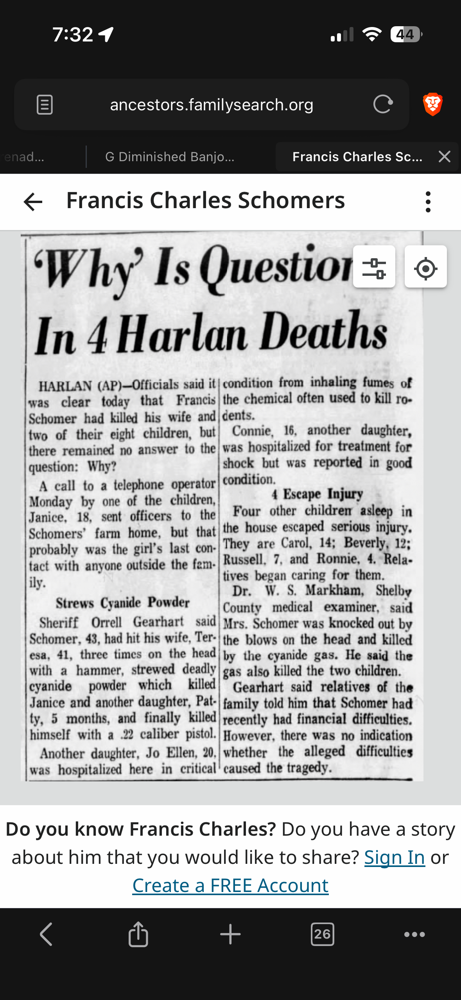
  
## 1899 - Zimmerman, Schmitz properties near Schomers   
  
### Shelby County (1899)  
[(link)](https://historicmapworks.com/Map/US/24123/County+Outline+Map/Shelby+County+1899/Iowa/)  
- Westphalia just north of Lincoln  
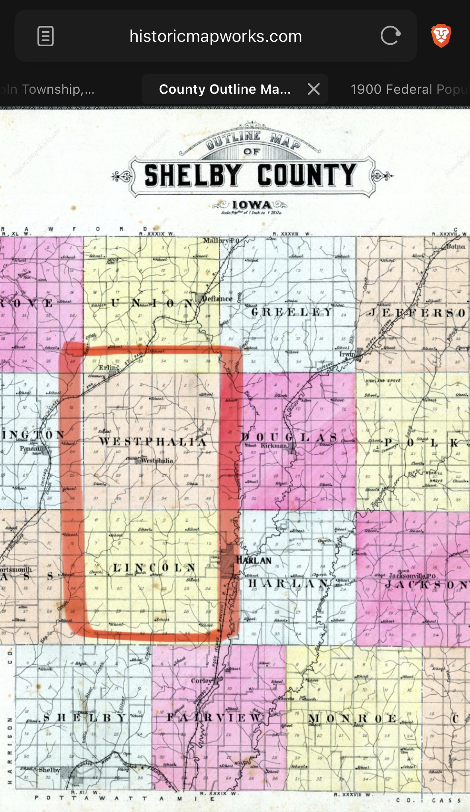  
  
### Westphalia Township Map (1899)  
[(link)](https://historicmapworks.com/Map/US/24144/Westphalia+Township/)  
- Schmitz and Zimmerman properties near Matthew Schomers (somewhat small) property   
  
- Emil Zimmerman  
  
- Adam and Anton Zimmerman were brothers  
  
- Adam Schmitz married Mary Anna Zimmerman  
  
###   
### Lincoln Township Map (1899)  
[(link)](https://historicmapworks.com/Map/US/24134/Lincoln+Township/Shelby+County+1899/Iowa/)  
  
- Kuhl’s were down in Lincoln township, but up north near the border with Westphalia   
  
- Mathias Kuhl  
  
   
### Business directory - Shelby County, Iowa (1899)  
[(link)](https://historicmapworks.com/Map/US/184042/Directory/Shelby+County+1899/Iowa/)  
- Kuhl and Zimmerman businesses  
- no businesses associated with Schmitz or Schomers  
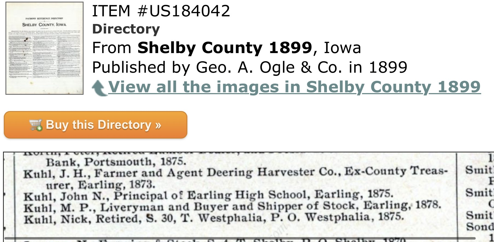  
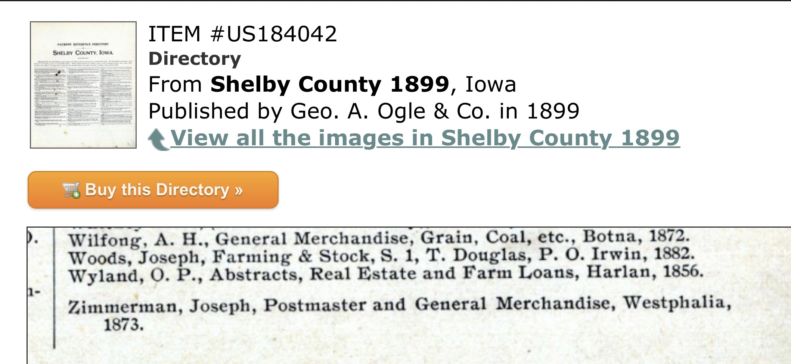  
  
##   
## 1946 - Kuhl’s have moved to Council Bluffs, but still have family in Westphalia   
  
- Matthew Kuhl (son of Mathias) married Josephine Marie Schmitz (daughter of Adam Schmitz and Mary Anna Zimmerman)   
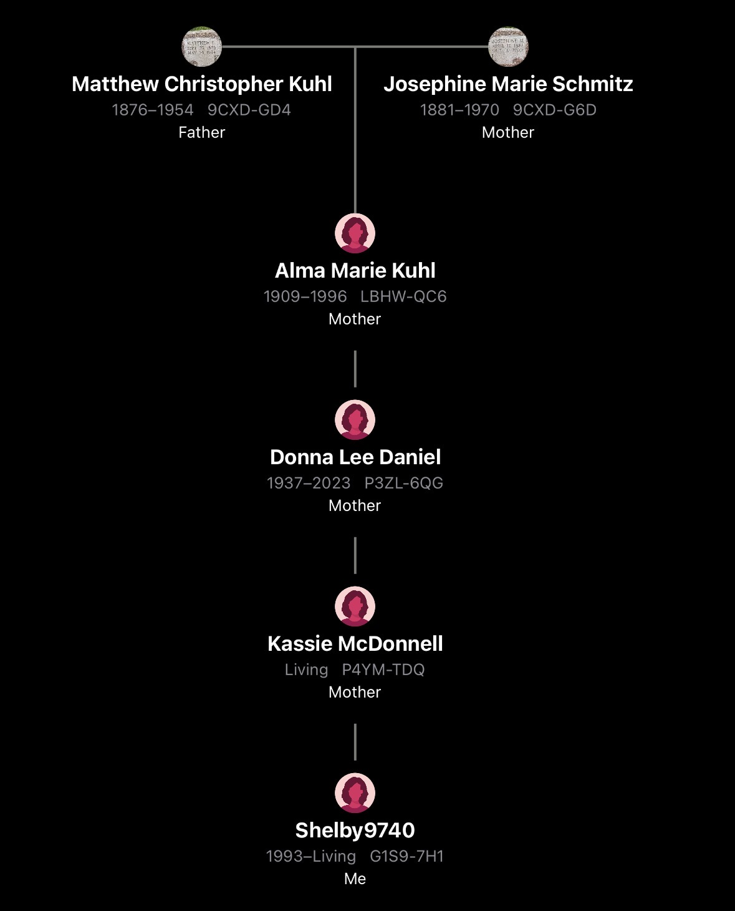  
  
### Westphalia Earling, Shelby County (1946)  
[(link)](https://historicmapworks.com/Map/US/150743/Westphalia+Earling/)  
  
- Emil Zimmerman  
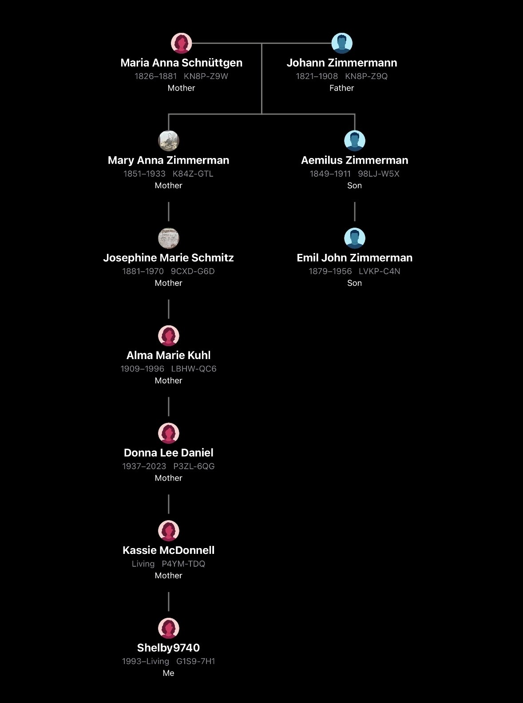  
- Francis Schmitz  
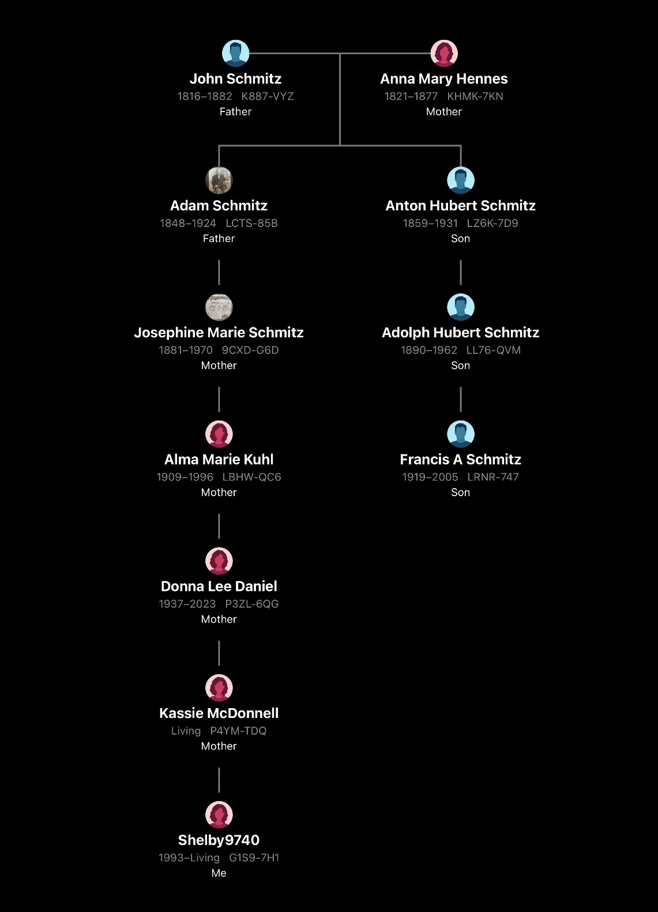  
- Leo J Schmitz   
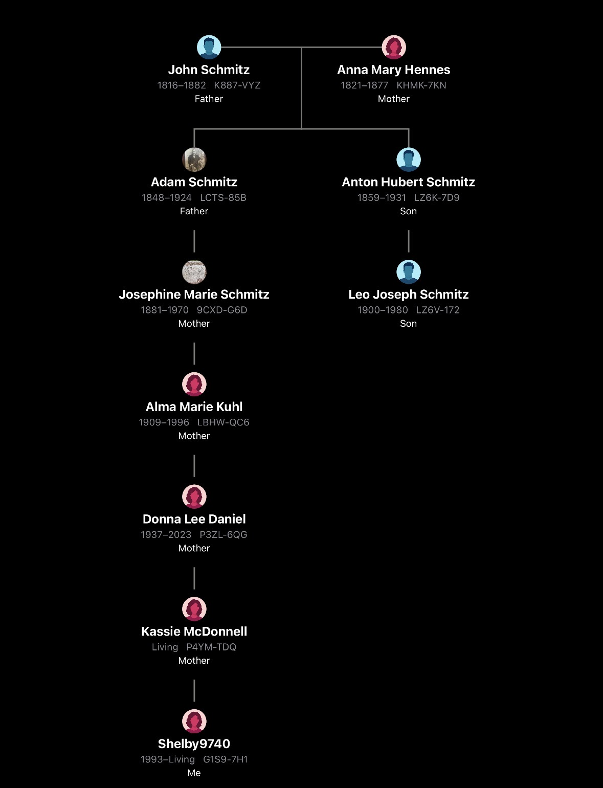  
- Rose Zimmerman  
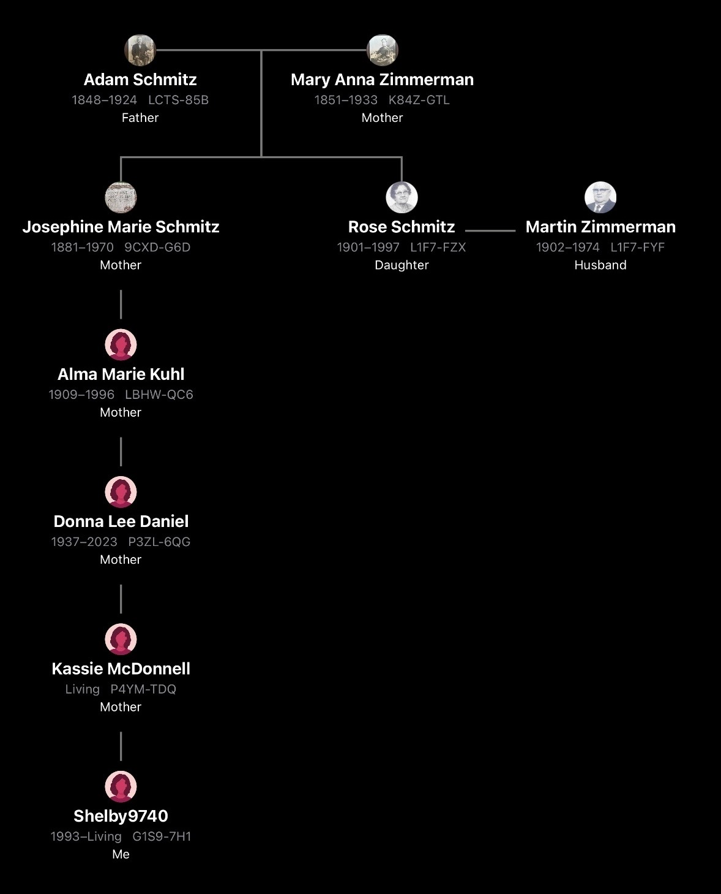  
- CJ Zimmerman  
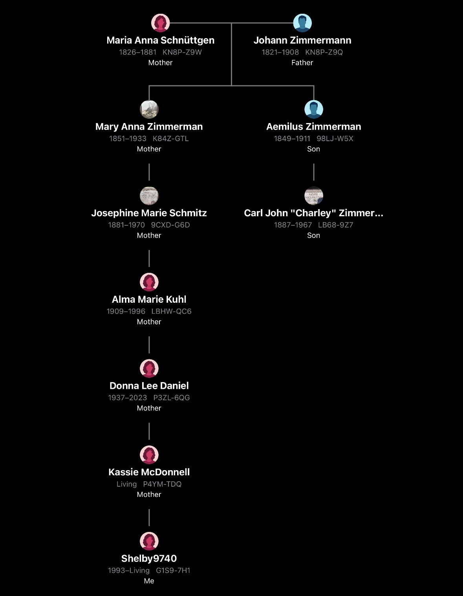  
- Peter Schmitz (no relation found - family is from Luxembourg, not Germany)  
  

(BONUS)
- Ella Mae Schomers (Francis' sister) married a Schmitz
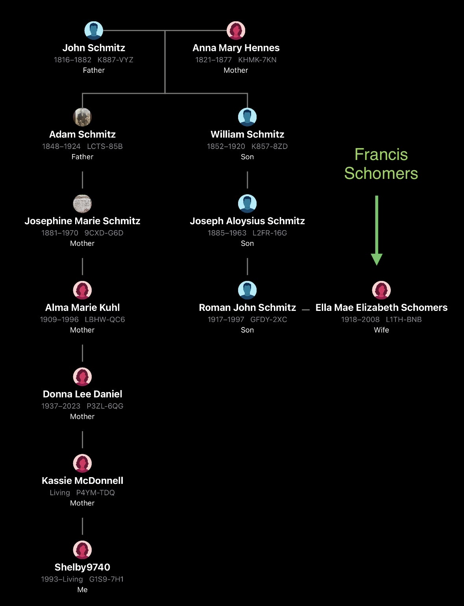
